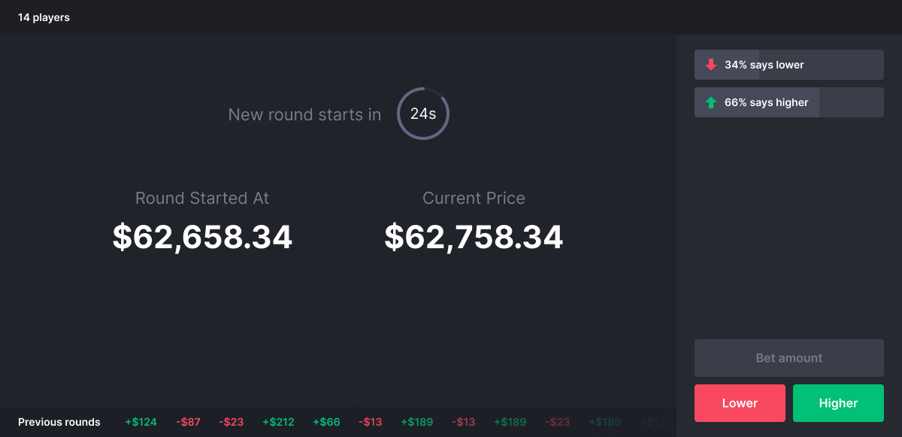

# Higher Lower

Do you have a crystal ball? Can you predict the future? Will the price of Bitcoin be higher or lower 30 seconds from now? Start guessing!

Every 30 seconds a snapshot of the price of Bitcoin is taken and shown on the page. This indicates the start of a new round. Then, next to it, the current price of Bitcoin is updated every second for the duration of the round.

During a round, users can place a bet by guessing if the price of Bitcoin will be higher or lower in the next 30 seconds. If a bet is placed during a round, it becomes active in the next round. This prevents placing a bet 1 second before the round ends and always making the right guess.

Live demo: [link]

## Concept idea



## API

External data source: [Binance Websocket Market Streams](https://binance-docs.github.io/apidocs/spot/en/#websocket-market-streams) 

Base endpoint: `wss://stream.binance.com:9443`  
Used stream: `wss://stream.binance.com:9443/ws/btcusdt@miniTicker`

_24hr rolling window mini-ticker statistics._

Update speed: 1000ms


## Data Flow

...

## Features

**Must haves:**

- [x] Connect with an external API to get the price of Bitcoin.
- [x] Get the price of Bitcoin in real time and update it every second.
- [x] Take a (separate) snapshot of the price of Bitcoin every 30 seconds (a round) and keep track of all rounds.
- [x] Keep track of connected clients.
- [x] Persistent session ID.  Refreshing the page, opening the page in another tab, closing the tab/browser and re-opening the app should reconnect the user using the same session with all associated user data.
- [x] All multiple clients to connect to the app.
- [x] Keep track of all placed bets (guesses) by all clients for a round. When a bet is made during an ongoing round, store it separately to use in the next round.

**Should haves:**

- [x] Store / keep track of all app (game) and user data in memory on the server.
- [x] Display all connected clients (online users) on the page.
- [x] Add/remove users on the page when they connect/disconnect.
- [ ] Update the online users with their placed bets (i.e. show which user has guessed higher/lower in round).
- [ ] Keep track of user and bet statistics and display them on the page (i.e. how many times a user has guessed the price correctly).

**Could haves:**

- [ ] Store all data in a database.

**Would haves:**

## Tech stack

### Server

For the server I'm using a Node.js Socket.io server that connects to the client and I use server sided Websockets to connect to the external Binance WS API to retrieve real time crypto currency data.

#### Server dependencies

```json
"dependencies": {
  "dotenv": "^8.2.0",
  "express": "^4.17.1",
  "node-fetch": "^2.6.1",
  "socket.io": "^4.0.1",
  "uuid": "^8.3.2",
  "ws": "^7.4.4"
}
```

### Client

Next.js (React) is used on the client side.

#### Client Dependencies

```json
"dependencies": {
  "next": "^9.5.1",
  "postcss-preset-env": "^6.7.0",
  "prop-types": "^15.7.2",
  "react": "^16.12.0",
  "react-dom": "^16.12.0",
  "sass": "^1.26.10",
  "socket.io-client": "^4.0.1"
}
```

## Installation

`git clone https://github.com/gv-minorweb/real-time-web-2021.git`

**Start server**

Move into the `server` directory  
Run `npm run dev`

**Start client**

Move into the `client` directory  
Run `npm run dev`